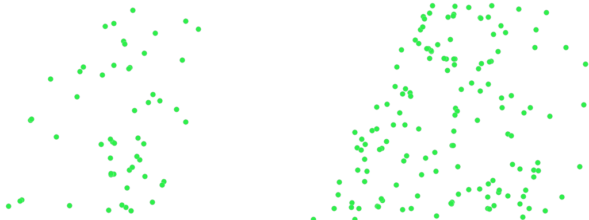
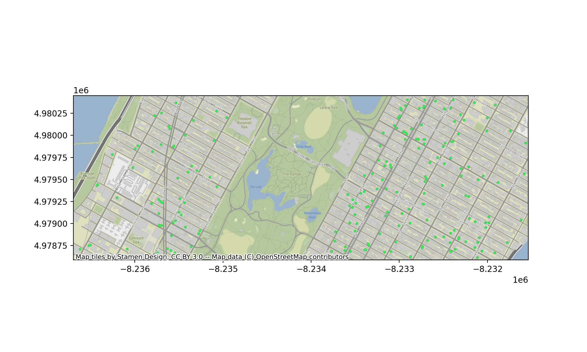
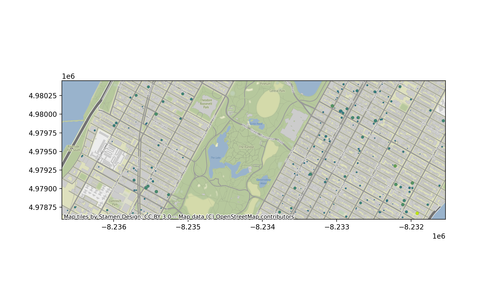
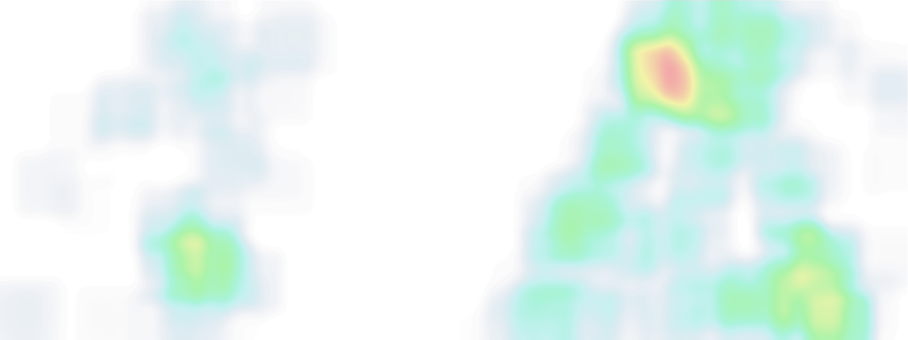
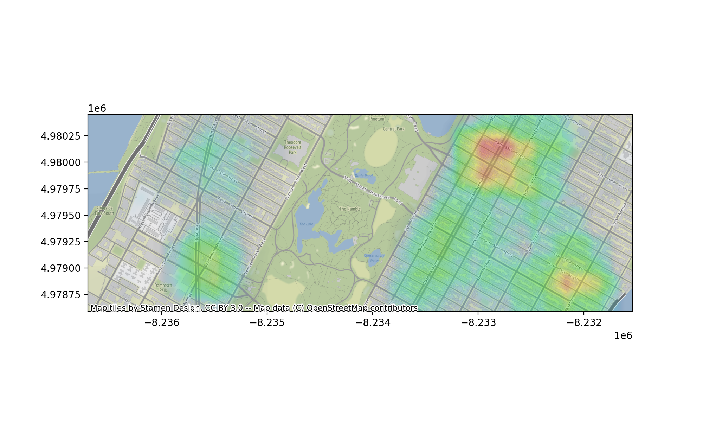
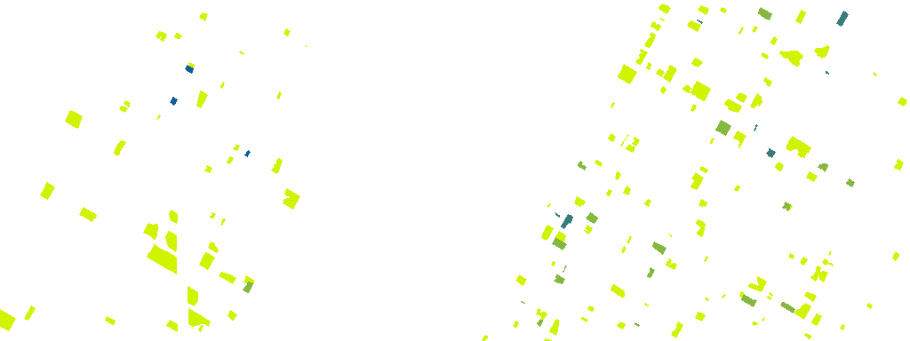
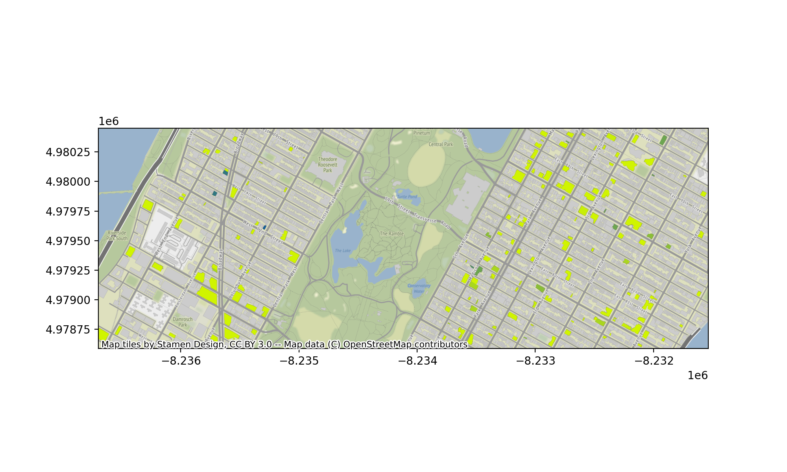
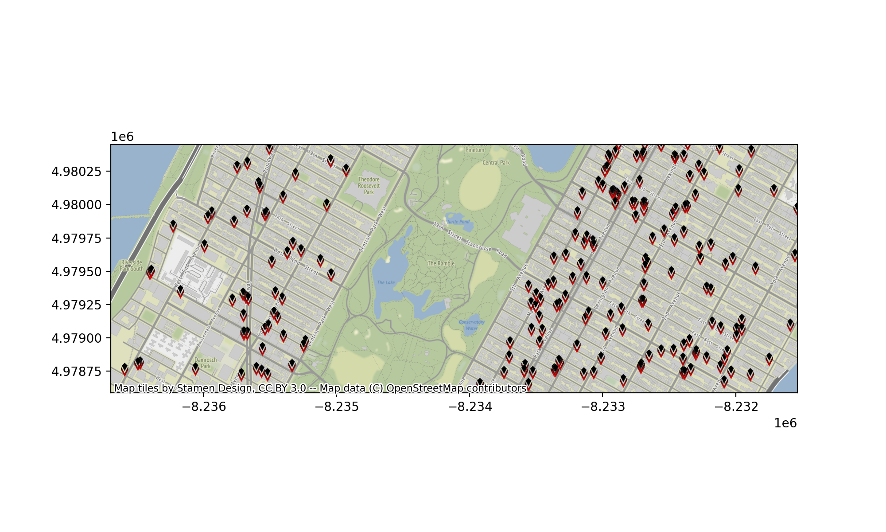

# Quick Start

本文以纽约出租车数据集为例，展示如何使用 Arctern 完成数据的导入、运算和展示。

## 数据准备

在 Arctern 运行环境中下载[纽约出租车数据集](https://media.githubusercontent.com/media/zilliztech/arctern-resources/benchmarks/benchmarks/dataset/nyc_taxi/0_2M_nyc_taxi_and_building/0_2M_nyc_taxi_and_building.csv)，该数据集包含2009年纽约市出租车运营记录，各字段的含义如下：

- VendorID: string，运营商名称；
- tpep_pickup_datetime: string，上车时间；
- tpep_dropoff_datetime: string，下车时间；
- passenger_count: long，乘客数量；
- trip_distance: double，行程距离；
- pickup_longitude: double，上车地点-经度；
- pickup_latitude: double，上车地点-纬度；
- dropoff_longitude: double，下车地点-经度；
- dropoff_latitude: double，下车地点-纬度；
- fare_amount: double，行程费用；
- tip_amount: double，小费；
- total_amount: double，总费用；
- buildingid_pickup: long，上车地点所在建筑的id；
- buildingid_dropoff: long，下车地点所在建筑的id；
- buildingtext_pickup: string，上车地点所在建筑的轮廓描述；
- buildingtext_dropoff: string，下车地点所在建筑的轮廓描述。

该数据中时间格式为：`yyyy-MM-dd HH:mm::ss XXXXX`，如`2009-04-12 03:16:33 +00:00`。

同时下载[arctern-icon-small.png](https://raw.githubusercontent.com/zilliztech/arctern-docs/master/img/icon/arctern-black.png)用于icon_viz绘制

## 设置数据路经
```python
>>> CSV_PATH = "/path/to/0_2M_nyc_taxi_and_building.csv"
>>> ICON_PATH = "/path/to/arctern-icon-small.png"
```

## 加载数据

以下通过 Python 交互界面展示 Arctern 的使用方法。根据测试数据各字段的名称和数据类型，构建导入测试数据的 `schema`并导入数据。

```python
>>> import pandas as pd
>>> nyc_schame={
...     "VendorID":"string",
...     "tpep_pickup_datetime":"string",
...     "tpep_dropoff_datetime":"string",
...     "passenger_count":"int64",
...     "trip_distance":"double",
...     "pickup_longitude":"double",
...     "pickup_latitude":"double",
...     "dropoff_longitude":"double",
...     "dropoff_latitude":"double",
...     "fare_amount":"double",
...     "tip_amount":"double",
...     "total_amount":"double",
...     "buildingid_pickup":"int64",
...     "buildingid_dropoff":"int64",
...     "buildingtext_pickup":"string",
...     "buildingtext_dropoff":"string",
... }
>>> df=pd.read_csv(CSV_PATH,
...                dtype=nyc_schame,
...                date_parser=pd.to_datetime,
...                parse_dates=["tpep_pickup_datetime","tpep_dropoff_datetime"])
```

打印数据的前5行，验证数据是否加载成功：

```python
>>> df.head()
  VendorID      tpep_pickup_datetime     tpep_dropoff_datetime  passenger_count  ...  buildingid_pickup  buildingid_dropoff  buildingtext_pickup                               buildingtext_dropoff
0      CMT 2009-04-12 03:16:33+00:00 2009-04-12 03:20:32+00:00                1  ...                  0                   0                 <NA>                                               <NA>
1      VTS 2009-04-14 11:22:00+00:00 2009-04-14 11:38:00+00:00                1  ...                  0              150047                 <NA>  POLYGON ((-73.9833003295812 40.7590607716671,-...
2      CMT 2009-04-15 09:34:58+00:00 2009-04-15 09:49:35+00:00                1  ...                  0                   0                 <NA>                                               <NA>
3      CMT 2009-04-30 18:58:19+00:00 2009-04-30 19:05:27+00:00                1  ...                  0              365034                 <NA>  POLYGON ((-73.9822052908304 40.7588972120254,-...
4      CMT 2009-04-26 13:03:04+00:00 2009-04-26 13:27:54+00:00                1  ...                  0                   0                 <NA>                                               <NA>

[5 rows x 16 columns]
```

## 数据过滤与预处理

在指定地理区域（经度范围：-73.991504至-73.945155；纬度范围：40.770759至40.783434）中选取`200` 行数据, 并生成点与建筑物两种 `Geometry`对象

```python
>>> bbox=[-73.991504, 40.770759, -73.945155, 40.783434] # [west, south]
>>> limit_num=200
>>> pickup_df = pickup_df[['pickup_longtitude', 'pickup_latitude', ]]
>>> pickup_df.dropna()
>>> pickup_df = df[(df.pickup_longitude>bbox[0]) & (df.pickup_longitude<bbox[2]) & (df.pickup_latitude>bbox[1]) & (df.pickup_latitude<bbox[3])]
>>> pickup_df = pickup_df.head(limit_num)
>>> points_series = ST_Point(pickup_df.pickup_longitude, pickup_df.pickup_latitude)
>>> fare_amount_series = pickup_df.fare_amount
>>> buildings_series = ST_GeomFromText(pickup_df.buildingtext_pickup)
```
                                                                                                                                                       
## 使用 Arctern 提供的 GeoSpatial 函数处理数据

导入 `arctern` 模块：

```python
>>> from arctern import *
```

根据经纬度数据创建坐标点数据：

```python
>>> ST_AsText(points_series).head()
0    POINT (-73.959908 40.776353)
1    POINT (-73.955183 40.773459)
2    POINT (-73.989523 40.77129)
3    POINT (-73.988154 40.774829)
4    POINT (-73.982687 40.771625)
dtype: object
```

将坐标点数据使用的空间坐标系从`EPSG:4326`坐标系转换为到`EPSG:3857`坐标系，更多不同空间坐标系标准的详细信息请查看[维基百科相关页面](https://en.wikipedia.org/wiki/Spatial_reference_system)。

```python
>>> ST_AsText(ST_Transform(points_series,'epsg:4326', 'epsg:3857')).head()
0    POINT (-8233179.29767736 4979409.53917853)
1    POINT (-8232653.31308336 4978984.12438949)
2    POINT (-8236476.0243972 4978665.29594441)
3    POINT (-8236323.6280143 4979185.5105596)
4    POINT (-8235715.04435814 4978714.5380168)
dtype: object
```
可以在[EPSG](http://epsg.io/transform#s_srs=4326&t_srs=3857)网站上验证转换是否正确


## 使用 Arctern 绘制图层与地图

导入绘图需要使用的模块：

```python
>>> from arctern.util import save_png
>>> from arctern.util.vega import vega_pointmap, vega_weighted_pointmap, vega_heatmap, vega_choroplethmap, vega_icon
```

### 点图图层：

```python
>>> # 绘制点大小为10，点颜色为#2DEF4A，点不透明度为1的点图图层。
>>> vega = vega_pointmap(1024, 384, bounding_box=bbox, point_size=10, point_color="#2DEF4A", opacity=1, coordinate_system="EPSG:4326")
>>> png = point_map_layer(vega, points_series)
>>> save_png(png, '/tmp/arctern_pointmap_pandas.png')
```

点图图层绘制结果如下：



直接在 matplotlib 中绘制

```python
>>> # 绘制点大小为10的点图图层。
>>> fig, ax = plt.subplots(figsize=(10, 6), dpi=200)
>>> plot_pointmap(ax, points_series, bbox, point_size=10)
>>> plt.savefig('/tmp/arctern_plot_pointmap_pandas.png')
```

绘制结果如下：



### 绘制带权点图：

```python
>>> # 绘制带权点图图层，点的颜色根据 fare_amount 在 "#115f9a" ~ "#d0f400" 之间变化，点的大小根据 total_amount 在 15 ~ 50 之间变化。
>>> vega = vega_weighted_pointmap(1024, 384, bounding_box=bbox, color_gradient=["#115f9a", "#d0f400"], color_bound=[1, 50], size_bound=[3, 15], opacity=1.0, coordinate_system="EPSG:4326")
>>> png = weighted_point_map_layer(vega, points_series, color_weights=df.fare_amount, size_weights=df.total_amount)
>>> save_png(png, "/tmp/arctern_weighted_pointmap_pandas.png")
```

带权点图图层绘制结果如下：


直接在 matplotlib 中绘制

```python
>>> # 绘制带权点图，点的颜色根据 fare_amount 在 "#115f9a" ~ "#d0f400" 之间变化，点的大小根据 total_amount 在 15 ~ 50 之间变化。
>>> fig, ax = plt.subplots(figsize=(10, 6), dpi=200)
>>> plot_weighted_pointmap(ax, points_series, df.fare_amount, df.total_amount, bbox, color_gradient=["#115f9a", "#d0f400"], color_bound=[1, 50], size_bound=[3, 15], opacity=1.0, coordinate_system="EPSG:4326")
>>> plt.savefig("/tmp/arctern_plot_weighted_pointmap_pandas.png")
```
绘制结果如下：



## 绘制热力图图层：

```python
>>> # 绘制热力图图层。
>>> vega = vega_heatmap(1024, 384, bounding_box=bbox, map_zoom_level=13.0, coordinate_system="EPSG:4326")
>>> png = heat_map_layer(vega, points_series, df.fare_amount)
>>> save_png(png, "/tmp/arctern_heatmap_pandas.png")
```

热力图图层绘制结果如下：



直接在 matplotlib 中绘制

```python
>>> # 绘制热力图。
>>> fig, ax = plt.subplots(figsize=(10, 6), dpi=200)
>>> plot_heatmap(ax, points_series, df.fare_amount, bbox, coordinate_system="EPSG:4326")
>>> plt.savefig("/tmp/arctern_plot_heatmap_pandas.png")
```

绘制结果如下：



### 绘制轮廓图图层：

```python
>>> # 绘制轮廓图图层，轮廓的填充颜色根据 fare_amount 在 "#115f9a" ~ "#d0f400" 之间变化。
>>> vega = vega_choroplethmap(1024, 384, bounding_box=bbox, color_gradient=["#115f9a", "#d0f400"], color_bound=[2.5, 5], opacity=1.0, coordinate_system="EPSG:4326")
>>> png = choropleth_map_layer(vega, buildings_series, df.fare_amount)
>>> save_png(png, "/tmp/arctern_choroplethmap_pandas.png")
```

轮廓图图层绘制结果如下：



直接在 matplotlib 中绘制

```python
>>> # 绘制轮廓图图层，轮廓的填充颜色根据 fare_amount 在 "#115f9a" ~ "#d0f400" 之间变化。
>>> fig, ax = plt.subplots(figsize=(10, 6), dpi=200)
>>> plot_choropleth_map(ax, buildings_series, df.fare_amount, bbox)
>>> plt.savefig("/tmp/arctern_plot_choroplethmap_pandas.png")
```

绘制结果如下：



### 绘制图标图图层：

```python
# >>> # 绘制图标图图层。
>>> vega = vega_icon(1024, 384, bounding_box=bbox, icon_path=ICON_PATH, coordinate_system="EPSG:4326")
>>> png = icon_viz_layer(vega, points_series.head(20))
>>> save_png(png, "/tmp/arctern_iconviz_pandas.png")
```

图标图图层绘制结果如下：


也可以直接在 matplotlib 中绘制

```python
>>> # 绘制图标图图层。
>>> fig, ax = plt.subplots(figsize=(10, 6), dpi=200)
>>> plot_iconviz(ax, points_series, ICON_PATH, bbox)
>>> plt.savefig("/tmp/arctern_plot_iconviz_pandas.png")
```

绘制结果如下：



### 绘制鱼网图图层：

```python
>>> # 绘制鱼网图图层。
>>> vega = vega_fishnetmap(1024, 384, bounding_box=bbox, cell_size=8, cell_spacing=1, opacity=1.0, coordinate_system="EPSG:4326")
>>> png = fishnet_map_layer(vega, points_series, df.fare_amount)
>>> save_png(png, "/tmp/arctern_fishnetmap_pandas.png")
```

鱼网图图层绘制结果如下：


## Matplotlib 使用其他地图提供商

以 Mapbox 为例
1. 参照 [Mapbox 文档](https://docs.mapbox.com/help/tutorials/get-started-tokens-api/)获取 Mapbox 的 token
2. 